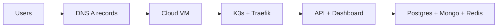
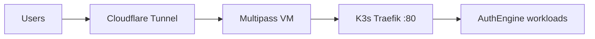

# Deployment Guide

AuthEngine production runs on a **single-node K3s cluster** with **Rancher**, **cert-manager**, and the **Helm chart** in `auth-engine-infra/helm/authengine`. Postgres, MongoDB, Redis, the API, and the dashboard are in-cluster workloads.

Choose one path:

| Path | Best for | Public IP | DNS |
|------|----------|-----------|-----|
| [**Cloud VM**](#cloud-vm-aws-or-any-provider) | Production, staging | Yes (Elastic IP / static IP) | A records → VM IP |
| [**Local VM**](#local-vm-laptop--cloudflare-tunnel) | Laptop lab, demos | No | **Cloudflare Tunnel** |

!!! abstract "Quick start scripts"
    ```bash
    cd auth-engine-infra

    # Laptop lab (Multipass + Cloudflare Tunnel)
    ./scripts/deploy-local-vm.sh all

    # Cloud VM (AWS Terraform + public DNS)
    ./scripts/deploy-aws.sh all
    ```

    See [`auth-engine-infra/scripts/README.md`](https://github.com/auth-engine/auth-engine-infra/blob/main/scripts/README.md).

---

## Hardware requirements

Single-node K3s + Rancher + AuthEngine (API, dashboard, Postgres, MongoDB, Redis):

| Profile | vCPU | RAM | Disk | Example |
|---------|------|-----|------|---------|
| **Lab / dev** | 4 | 8 GB | 40 GB | Multipass `4 CPU / 8G`, AWS `t3.large` |
| **Production** | 4 | 16 GB | 80 GB | AWS `t4g.xlarge`, Hetzner `cpx31`, GCP `e2-standard-4` |
| **Minimum (tight)** | 2 | 4 GB | 30 GB | May OOM during seed Job — not recommended |

- **Architecture:** ARM64 (AWS Graviton `t4g`) and x86_64 both work.
- **Network:** ports **80** and **443** open on the VM firewall (cloud path only).
- **Local dev** without Kubernetes: use Docker Compose in `auth-engine-infra/compose/` — see [Quick Start](quick-start.md).

```bash
./scripts/deploy-aws.sh specs      # cloud
./scripts/deploy-local-vm.sh specs # local VM
```

---

## Platform URLs

Replace `authengine.org` with your domain in `helm/authengine/local-values.yaml` or `prod-values.yaml`.

| Host | Role |
|------|------|
| `api.<domain>` | REST API, Swagger, `/.well-known` |
| `auth.<domain>` | OIDC login UI (same API deployment) |
| `app.<domain>` | Admin dashboard |
| `rancher.<domain>` | Rancher cluster UI |

---

## Cloud VM (AWS or any provider)

Works on **any cloud** that gives you a Linux VM with a public IP: AWS EC2, GCP Compute Engine, Azure VM, Hetzner, DigitalOcean, Oracle Cloud, etc.

### Architecture



### Option A — AWS (Terraform included)

```bash
cd auth-engine-infra

# 1. Configure Terraform
cp terraform/terraform.tfvars.example terraform/terraform.tfvars
# Set ec2_instance_type = "t4g.xlarge" for production

# 2. Full guided deploy
./scripts/deploy-aws.sh all
```

Or step by step:

```bash
./scripts/deploy-aws.sh plan      # terraform plan
./scripts/deploy-aws.sh apply     # create EC2 + Elastic IP
./scripts/deploy-aws.sh dns       # print DNS A records
./scripts/deploy-aws.sh k3s       # install K3s + Rancher via AWS SSM
./scripts/deploy-aws.sh helm        # helm upgrade (kubectl context required)
./scripts/deploy-aws.sh verify
```

**Connect to EC2** (no SSH key required):

```bash
aws ssm start-session --target $(terraform -chdir=terraform output -raw ec2_instance_id)
```

**DNS** — point A records at the Elastic IP:

```text
api.<domain>     → <ELASTIC_IP>
auth.<domain>    → <ELASTIC_IP>
app.<domain>     → <ELASTIC_IP>
rancher.<domain> → <ELASTIC_IP>
```

### Option B — Any other cloud provider

Skip Terraform. Create a VM matching the [hardware table](#hardware-requirements), then on the VM:

```bash
# K3s
curl -sfL https://get.k3s.io | sh -
export KUBECONFIG=/etc/rancher/k3s/k3s.yaml
sudo kubectl get nodes

# Helm
curl -fsSL -o get_helm.sh https://raw.githubusercontent.com/helm/helm/main/scripts/get-helm-3
chmod 700 get_helm.sh && ./get_helm.sh

# cert-manager + Rancher
helm repo add rancher-latest https://releases.rancher.com/server-charts/latest
helm repo add jetstack https://charts.jetstack.io && helm repo update
helm install cert-manager jetstack/cert-manager \
  --namespace cert-manager --create-namespace --set installCRDs=true
helm install rancher rancher-latest/rancher \
  --namespace cattle-system --create-namespace \
  --set hostname=rancher.<your-domain> \
  --set replicas=1 --set bootstrapPassword=admin
```

Copy `kubeconfig` to your laptop, create DNS A records, then:

```bash
cd auth-engine-infra
cp helm/authengine/values.yaml helm/authengine/prod-values.yaml
# Edit secrets + seed.* — do not commit

export HELM_VALUES_FILE=helm/authengine/prod-values.yaml
export HELM_NAMESPACE=authengine
./scripts/deploy-aws.sh helm
```

---

## Local VM (laptop + Cloudflare Tunnel)

Use this when the cluster runs on your **laptop** (Multipass) and has **no public IP**. **Cloudflare Tunnel** exposes `api`, `auth`, `app`, and `rancher` without port forwarding.

### Architecture



### Fast path

```bash
cd auth-engine-infra

# Edit domain + secrets first
cp helm/authengine/values.yaml helm/authengine/local-values.yaml

./scripts/deploy-local-vm.sh all
```

Or step by step:

```bash
./scripts/deploy-local-vm.sh vm-create    # Multipass: 4 CPU, 8G RAM, 40G disk
./scripts/deploy-local-vm.sh sync         # copy helm chart into VM
./scripts/deploy-local-vm.sh k3s          # K3s + Rancher on VM
./scripts/deploy-local-vm.sh cloudflare   # tunnel setup guide
./scripts/deploy-local-vm.sh helm         # deploy AuthEngine
./scripts/deploy-local-vm.sh verify
```

### Cloudflare Tunnel (summary)

On the VM:

```bash
multipass shell authengine-lab

# Install cloudflared
sudo apt update && sudo apt install -y cloudflared

# Login + create tunnel
cloudflared tunnel login
cloudflared tunnel create authengine

# Route DNS (repeat per hostname)
cloudflared tunnel route dns authengine api.<your-domain>
cloudflared tunnel route dns authengine auth.<your-domain>
cloudflared tunnel route dns authengine app.<your-domain>
cloudflared tunnel route dns authengine rancher.<your-domain>
```

Config template: `auth-engine-infra/scripts/templates/cloudflared-config.yml.tpl` — point all hostnames to `http://127.0.0.1:80` (K3s Traefik). TLS terminates at Cloudflare.

```bash
sudo cloudflared --config /etc/cloudflared/config.yml tunnel run
```

### Multipass defaults

| Variable | Default |
|----------|---------|
| `VM_NAME` | `authengine-lab` |
| `VM_CPUS` | `4` |
| `VM_MEM` | `8G` |
| `VM_DISK` | `40G` |
| `HELM_NAMESPACE` | `auth-dev` |

---

## Helm install (both paths)

Create a values override (never commit secrets):

```yaml
# prod-values.yaml or local-values.yaml
global:
  domain: "your-domain.com"

secrets:
  postgresPassword: "<openssl rand -base64 24>"
  mongoPassword: "<openssl rand -base64 24>"
  redisPassword: "<openssl rand -base64 24>"
  secretKey: "<openssl rand -hex 32>"
  jwtSecretKey: "<openssl rand -hex 32>"
  resendApiKey: "re_..."

seed:
  enabled: true
  runOnUpgrade: true          # set true to re-run seed on helm upgrade
  superadminEmail: "admin@your-domain.com"
  superadminPassword: "<strong-password>"
```

```bash
helm upgrade --install authengine helm/authengine \
  --namespace auth-dev \
  --create-namespace \
  -f helm/authengine/local-values.yaml \
  --set seed.enabled=true \
  --set seed.runOnUpgrade=true
```

After install:

```bash
kubectl get pods,jobs -n auth-dev
kubectl logs -n auth-dev job/authengine-seed-<revision>
kubectl logs -n auth-dev job/authengine-migrate
```

The chart deploys:

- Postgres, MongoDB, Redis (StatefulSets)
- API + dashboard (Deployments)
- Ingress for `api`, `auth`, `app`
- **migrate Job** on install/upgrade
- **seed Job** when `seed.enabled=true` (platform tenant + super admin + auth config)

---

## Seed data

The API does **not** seed on startup. The Helm seed Job runs `auth-engine-data all` (roles, super admin, platform auth config).

| Method | Command |
|--------|---------|
| Helm (recommended) | `seed.enabled: true` + `helm upgrade` |
| Re-run seed | `helm upgrade ... --set seed.runOnUpgrade=true` |
| Manual | `cd auth-engine-data && uv run auth-engine-data all` |

Default super admin (if using `local-values.yaml` example): check your `seed.superadminEmail` / `seed.superadminPassword` in values.

Verify:

```bash
curl -s https://api.<domain>/api/v1/auth/auth-config | jq
# Expected: tenant_id + allowed_methods: ["email_password"]
```

---

## OAuth redirect URIs

```text
https://api.<domain>/api/v1/auth/oauth/google/callback
https://api.<domain>/api/v1/auth/oauth/github/callback
https://api.<domain>/api/v1/auth/oauth/microsoft/callback
https://app.<domain>/oauth/authengine/callback
```

---

## CI/CD and upgrades

Merging to `main` in `auth-engine` / `auth-engine-dashboard` builds Docker images. **Redeploy manually:**

```bash
kubectl rollout restart deployment/api deployment/dashboard -n auth-dev
kubectl exec -n auth-dev deployment/api -- auth-engine migrate
```

---

## Verification checklist

| Check | Command / URL |
|-------|----------------|
| API health | `curl https://api.<domain>/api/v1/health` |
| Auth config | `curl https://api.<domain>/api/v1/auth/auth-config` |
| Swagger | `https://api.<domain>/docs` |
| Dashboard login | `https://app.<domain>/login` |
| Rancher | `https://rancher.<domain>` |

```bash
./scripts/deploy-aws.sh verify
# or
./scripts/deploy-local-vm.sh verify
```

---

## Local vs Kubernetes

| Item | Docker Compose (`compose/`) | K3s + Helm |
|------|----------------------------|------------|
| Use case | Dev on laptop | Lab / production |
| TLS | Optional | Ingress + cert-manager (cloud) or Cloudflare (local VM) |
| Seed | `auth-engine-data all` manually | Helm seed Job |
| Scripts | — | `deploy-local-vm.sh` / `deploy-aws.sh` |

---

## Next

| Step | Guide |
|------|-------|
| Local dev without K8s | [Quick Start](quick-start.md) |
| Architecture | [Architecture](architecture.md) |
| OAuth / OIDC | [OAuth2 / OIDC Guides](oauth2-oidc-guides.md) |
| Security | [Security Overview](security-overview.md) |
