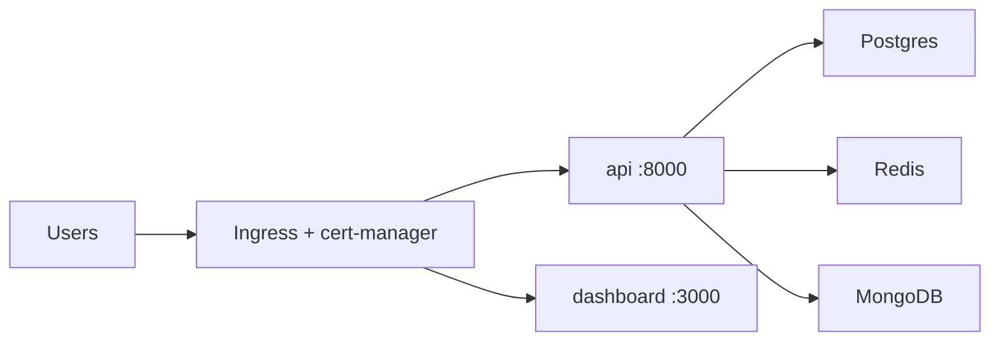

# Deployment Guide

Production runs on a **single AWS EC2 instance** with **K3s**, **Rancher**, and the **Helm chart** in `auth-engine-infra/helm/authengine`. Postgres, MongoDB, Redis, the API, and the dashboard all run as Kubernetes workloads. TLS is handled by **cert-manager** on the cluster ingress.

!!! abstract "Deployment sequence"
    Complete phases **in order**:

    **1** Terraform → **2** DNS → **3** K3s + Rancher → **4** Helm install → **5** Seed data → **6** OAuth URIs → **7** CI/CD (build) → **8** Docs site → **9** Verify

---

## Platform URLs (production)

| Host | Role | Backend |
|------|------|---------|
| [authengine.org](https://authengine.org) | Product home | Ingress redirect (optional) |
| [api.authengine.org](https://api.authengine.org) | REST API, Swagger, `/.well-known` | `api` Deployment → port 8000 |
| [auth.authengine.org](https://auth.authengine.org) | OIDC login UI and IdP endpoints | Same `api` Deployment |
| [app.authengine.org](https://app.authengine.org) | Admin dashboard | `dashboard` Deployment → port 3000 |
| [rancher.authengine.org](https://rancher.authengine.org) | Cluster management UI | Rancher Server |
| [docs.authengine.org](https://docs.authengine.org) | This documentation | MkDocs on GitHub Pages |

## 1. Architecture overview

| Layer | Provider | Notes |
|-------|----------|-------|
| Compute | AWS EC2 (`t4g.xlarge` recommended) | Single node; K3s + Rancher + workloads |
| API | Kubernetes `api` Deployment | Image `qniranjan01/authengine:latest` |
| Dashboard | Kubernetes `dashboard` Deployment | Image `qniranjan01/authengine-dashboard:latest` |
| PostgreSQL | In-cluster StatefulSet | Helm chart `postgres` |
| MongoDB | In-cluster StatefulSet | Helm chart `mongodb` |
| Redis | In-cluster StatefulSet | Helm chart `redis` |
| TLS / routing | nginx Ingress + cert-manager | Managed via Rancher or Helm |
| Email | **Resend** (recommended) | API key in Helm values / platform seed |
| Docs | GitHub Pages | MkDocs build from **auth-engine-docs** |



**Local development** still uses Docker Compose in `auth-engine-infra/compose/` — that path is separate from production.

## 2. Phase 1 — Terraform (EC2 only)

Terraform provisions **one EC2 instance** with an Elastic IP and SSM access. It does **not** create RDS, SES, or ECR.

```bash
cd auth-engine-infra/terraform
cp terraform.tfvars.example terraform.tfvars
# Set ec2_instance_type = "t4g.xlarge" (or t4g.large minimum)
terraform init
terraform plan
terraform apply
```

Or use the helper script:

```bash
cd auth-engine-infra
./deploy/auth-engine-deploy.sh plan
./deploy/auth-engine-deploy.sh apply
```

### Resources created

- VPC with public subnet
- EC2 instance (Amazon Linux 2023 ARM) + Elastic IP
- Security group (HTTP/HTTPS + optional SSH)
- IAM role with `AmazonSSMManagedInstanceCore` (Session Manager)

Key outputs: `ec2_public_ip`, `ec2_instance_id`, `suggested_urls`, `rancher_setup_instructions`.

| Variable | Default | Purpose |
|----------|---------|---------|
| `aws_region` | `ap-south-1` | Region |
| `ec2_instance_type` | `t4g.micro` | **Use `t4g.xlarge` in production** (K3s + DBs + apps) |
| `root_domain` | `authengine.org` | DNS reference |

**GitHub Actions:** `auth-engine-infra · Terraform Plan` → review → `auth-engine-infra · Terraform Apply` (manual `workflow_dispatch`).

## 3. Phase 2 — DNS

Point application hosts at the EC2 Elastic IP from `terraform output ec2_public_ip`:

| Host | Type | Target |
|------|------|--------|
| `api` | A | EC2 Elastic IP |
| `auth` | A | Same Elastic IP |
| `app` | A | Same Elastic IP |
| `rancher` | A | Same Elastic IP |
| `docs` | CNAME | `auth-engine.github.io` (GitHub Pages) |

```bash
./deploy/auth-engine-deploy.sh dns
```

Use TTL **300** during initial setup.

## 4. Phase 3 — K3s and Rancher

Connect to the instance (no SSH key required):

```bash
aws ssm start-session --target $(terraform output -raw ec2_instance_id)
```

### Install K3s

```bash
curl -sfL https://get.k3s.io | sh -
sudo k3s kubectl get nodes
```

### Install Helm

```bash
curl -fsSL -o get_helm.sh https://raw.githubusercontent.com/helm/helm/main/scripts/get-helm-3
chmod 700 get_helm.sh && ./get_helm.sh
```

### Install Rancher + cert-manager

Ensure `rancher.<your-domain>` DNS points to the Elastic IP first.

```bash
export KUBECONFIG=/etc/rancher/k3s/k3s.yaml

helm repo add rancher-latest https://releases.rancher.com/server-charts/latest
helm repo add jetstack https://charts.jetstack.io
helm repo update

helm install cert-manager jetstack/cert-manager \
  --namespace cert-manager --create-namespace --set installCRDs=true

helm install rancher rancher-latest/rancher \
  --namespace cattle-system --create-namespace \
  --set hostname=rancher.authengine.org \
  --set replicas=1 \
  --set bootstrapPassword=admin
```

Open `https://rancher.authengine.org`, log in, and change the bootstrap password.

```bash
./deploy/auth-engine-deploy.sh k3s-guide   # prints these steps
```

## 5. Phase 4 — Helm install (full stack)

On your laptop (with `kubeconfig` copied from the EC2 K3s cluster, or via Rancher UI):

```bash
cd auth-engine-infra/helm/authengine
```

Create a production override file (do **not** commit secrets):

```yaml
# prod-values.yaml
global:
  domain: authengine.org

secrets:
  postgresPassword: "<openssl rand -base64 24>"
  mongoPassword: "<openssl rand -base64 24>"
  redisPassword: "<openssl rand -base64 24>"
  secretKey: "<openssl rand -hex 32>"
  jwtSecretKey: "<openssl rand -hex 32>"
  resendApiKey: "re_..."

seed:
  enabled: true
  superadminEmail: "you@example.com"
  superadminPassword: "<strong-password>"
```

Install:

```bash
helm install authengine . \
  --namespace authengine \
  --create-namespace \
  -f prod-values.yaml
```

This deploys:

- Postgres, MongoDB, Redis (StatefulSets with persistent volumes)
- API and dashboard Deployments (pull from Docker Hub)
- Ingress rules for `api`, `auth`, and `app`
- A **post-install migrate Job** (`auth-engine migrate`)
- An optional **seed Job** when `seed.enabled: true` (roles + super admin + platform config)

```bash
./deploy/auth-engine-deploy.sh helm-install   # guided install with checks
```

### After Helm install

```bash
kubectl -n authengine get pods
kubectl -n authengine logs job/authengine-migrate
kubectl -n authengine logs job/authengine-seed    # if seed enabled
```

## 6. Phase 5 — Seed data

The API does **not** seed on startup. Run seeding **once** after the first successful migrate.

### Option A — Helm seed Job (recommended for first deploy)

Set in `prod-values.yaml`:

```yaml
seed:
  enabled: true
  superadminEmail: "admin@example.com"
  superadminPassword: "ChangeThisStrongPassword123!"
```

Re-install or upgrade with that values file. The Job clones **auth-engine** + **auth-engine-data** and runs `auth-engine-data all`.

### Option B — Manual (auth-engine-data)

From a machine that can reach the cluster Postgres service:

```bash
cd auth-engine-data
cp .env.example .env.local
# POSTGRES_URL → in-cluster or port-forwarded URL
# SECRET_KEY → same as Helm secrets.secretKey
# SUPERADMIN_EMAIL / SUPERADMIN_PASSWORD
uv run auth-engine-data all
```

### Option C — Deploy script (SSM on EC2)

```bash
./deploy/auth-engine-deploy.sh k8s-seed
```

### Platform config (email, SMS, OAuth)

Optional env vars in **auth-engine-data** `.env.example` — used by `auth-engine-data platform-config` or included in `all`:

| Variable | Production note |
|----------|-----------------|
| `EMAIL_PROVIDER` | `resend` (recommended on K8s) |
| `EMAIL_PROVIDER_API_KEY` | Resend API key |
| `EMAIL_SENDER` | `noreply@authengine.org` |
| `GOOGLE_*`, `AUTHENGINE_*` | Social login (after OAuth URIs registered) |

After seeding, manage platform email/SMS/OAuth in the **dashboard** (Communications / Auth settings).

## 7. Phase 6 — OAuth redirect URIs

Register in each provider console:

```text
https://api.authengine.org/api/v1/auth/oauth/google/callback
https://api.authengine.org/api/v1/auth/oauth/github/callback
https://api.authengine.org/api/v1/auth/oauth/microsoft/callback
https://app.authengine.org/oauth/authengine/callback
```

```bash
./deploy/auth-engine-deploy.sh oauth
```

## 8. Phase 7 — CI/CD (build only)

Merging to `main` in each app repo **builds and pushes** Docker images. There is **no automatic cluster deploy** — redeploy workloads after a new image lands on Docker Hub.

### Pipeline (both app repos)

| Step | Workflow | Trigger |
|------|----------|---------|
| 1 | `0-ci` — lint / typecheck / build | Push or PR to `main` |
| 2 | `1-build-push` — push `:latest` to Docker Hub | After CI succeeds on `main` |
| 3 | Manual redeploy | Rancher UI or `kubectl rollout restart` |

**Secrets (both repos):** `DOCKERHUB_USERNAME`, `DOCKERHUB_TOKEN`

### auth-engine

| Workflow | Purpose |
|----------|---------|
| auth-engine · Lint and Typecheck | CI |
| auth-engine · Build and Push Docker Image | Push `DOCKERHUB_USERNAME/authengine:latest` |
| auth-engine · Create Version Tag | Manual tag (`v1.0.0`) |
| auth-engine · Create GitHub Release | Manual release |

### auth-engine-dashboard

| Workflow | Purpose |
|----------|---------|
| auth-engine-dashboard · Lint and Build | CI (bakes `NEXT_PUBLIC_*` at build time) |
| auth-engine-dashboard · Build and Push Docker Image | Push `DOCKERHUB_USERNAME/authengine-dashboard:latest` |
| auth-engine-dashboard · Create Version Tag | Manual tag |
| auth-engine-dashboard · Create GitHub Release | Manual release |

### Release workflow

1. Merge to `main` → CI → image pushed to Docker Hub
2. **API:** Rancher → Workloads → `api` → **Redeploy** (or `kubectl rollout restart deployment/api -n authengine`)
3. **API releases:** run migrate in the pod: `kubectl exec -n authengine deployment/api -- auth-engine migrate`
4. **Dashboard:** Rancher → `dashboard` → **Redeploy**

```bash
./deploy/auth-engine-deploy.sh cicd
./deploy/auth-engine-deploy.sh k8s-migrate   # after API image update
```

## 9. Phase 8 — Documentation site (`docs.authengine.org`)

Docs live in the **auth-engine-docs** repository, built by GitHub Actions, served on **GitHub Pages** — not from EC2.

1. **auth-engine-docs** Settings → Pages → Source: **GitHub Actions**
2. Run workflow **auth-engine-docs · Deploy docs** (`workflow_dispatch`)
3. Custom domain: `docs.authengine.org` (see `docs/CNAME`)
4. DNS: CNAME `docs` → `auth-engine.github.io`
5. Enable **Enforce HTTPS** in Pages settings

```bash
./deploy/auth-engine-deploy.sh docs
```

## 10. Phase 9 — Production verification

| Check | Command or URL |
|-------|----------------|
| API health | `curl https://api.authengine.org/api/v1/health` |
| Swagger | https://api.authengine.org/docs |
| OIDC discovery | `curl https://api.authengine.org/.well-known/openid-configuration` |
| Dashboard login | https://app.authengine.org/login |
| Rancher | https://rancher.authengine.org |
| Docs site | https://docs.authengine.org |

```bash
./deploy/auth-engine-deploy.sh verify
```

---

## Reference — Local vs production

| Item | Local (`compose/docker-compose.yml`) | Production (Helm / K3s) |
|------|--------------------------------------|-------------------------|
| `APP_URL` | `http://localhost:3000` | `https://auth.authengine.org` |
| `DASHBOARD_URL` | `http://localhost:3000` | `https://app.authengine.org` |
| CORS | `http://localhost:3000` | `https://app.authengine.org` |
| Databases | Postgres, Mongo, Redis in Compose | In-cluster StatefulSets |
| Images | Build locally or pull | Pull from Docker Hub |
| TLS | Optional | Ingress + cert-manager |
| Deploy | `docker compose up` | Helm + Rancher redeploy |

## Helper script commands

From `auth-engine-infra`:

```bash
./deploy/auth-engine-deploy.sh plan          # Terraform plan
./deploy/auth-engine-deploy.sh apply         # Terraform apply
./deploy/auth-engine-deploy.sh dns           # DNS checklist
./deploy/auth-engine-deploy.sh k3s-guide       # K3s + Rancher steps
./deploy/auth-engine-deploy.sh helm-install  # Helm install guide
./deploy/auth-engine-deploy.sh k8s-migrate    # Run migrate via kubectl (SSM)
./deploy/auth-engine-deploy.sh k8s-seed       # Run seed Job via kubectl (SSM)
./deploy/auth-engine-deploy.sh seed           # Local seed (compose dev)
./deploy/auth-engine-deploy.sh cicd           # CI/CD checklist
./deploy/auth-engine-deploy.sh verify         # Curl health endpoints
./deploy/auth-engine-deploy.sh all            # Interactive walk-through
```

## Next

| Step | Guide |
|------|-------|
| Previous — local setup | [Quick Start](quick-start.md) |
| System design | [Architecture](architecture.md) |
| Hardening | [Security Overview](security-overview.md) |
